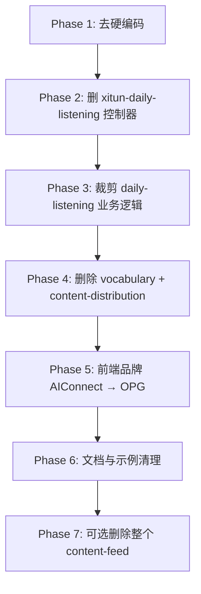

# Xitun / 私人项目剥离调研

> 调研日期：2026-06-09  
> **执行日期：2026-06-09** — 已按本文档完成主要代码剥离；**content-feed 整模块已于同日删除**（Phase 7）。  
> 目标：为开源化做准备，识别并列出所有与 **xitun（西豚小语种）** 及原私人项目（ArtiSalesBackend、谈案宝等）绑定的功能、配置与品牌残留。

## 调研方法

- 全仓库关键词扫描：`xitun`、`西豚`、`Xitun`、`ArtiSales`、`artisales`、`tananbao`、`谈案宝`、`AIConnect`、`thrivingos`、`daily-listening`、`daily_listening_membership` 等。
- 对照 `services/gateway/src/app.module.ts` 注册的 NestJS 模块与 `apps/web` 管理后台页面。
- 区分三类处理策略：**整模块删除**、**去品牌化/去硬编码**、**保留为通用平台能力**。

## 结论摘要

| 类别 | 数量级 | 建议 |
| --- | --- | --- |
| 直接 xitun 品牌/域名硬编码 | ~25 处 | 删除或改为环境变量/租户配置，不设 xitun 默认值 |
| xitun 核心业务功能 | 2 大域 + 若干子功能 | 整模块或整块逻辑删除 |
| 原 ArtiSales / 谈案宝 / AIConnect 遗留 | ~15 处 | 重命名为 OPG 中性名称 |
| 其他租户专用逻辑（redbox 等） | 少量 | 删除 slug 特判，改为配置驱动 |

**核心判断：** xitun 在本仓库中不仅是品牌名，更是一套完整的「小语种学习」业务（每日听力、词书、学习看板、语种会员、内容分发）。开源版若定位为通用「一人集团 / 多租户后台」，应删除或大幅裁剪这些业务域，仅保留平台级能力（认证、租户、AI 网关、支付、运营后台等）。

---

## 一、建议整模块删除（xitun 专属业务）

### 1.1 每日听力（Daily Listening）

xitun 的核心付费内容形态：`collection_key = 'daily-listening'` 的播客/音频订阅，配套会员权益 `daily_listening_membership`。

#### 后端

| 路径 | 说明 |
| --- | --- |
| `services/gateway/src/modules/content-feed/xitun-daily-listening/` | **整目录删除**。`XitunDailyListeningAdminController` 提供播客任务中心、AI 字幕/摘要/审核等管理 API，路由与 `ContentFeedAdminController` 重叠但单独以 Xitun 命名。 |
| `services/gateway/src/modules/content-feed/content-feed.service.ts` | 删除 `isDailyListeningQuery`、`assertDailyListeningAccess`、`hasDailyListeningAccess` 及所有 `daily-listening` 分支；默认 `collection` 不应再 fallback 到 `daily-listening`（约 L534）。 |
| `services/gateway/src/modules/content-feed/content-feed-review.service.ts` | 删除 `daily-listening-*` 相关 prompt、`request_path`、审核策略。 |
| `services/gateway/src/modules/content-feed/content-feed-review-policy.ts` | 删除 `daily-listening-review-summary-v1` 等策略项。 |
| `services/gateway/src/modules/content-feed/content-feed.module.ts` | 移除 `XitunDailyListeningAdminController` 注册。 |
| `services/gateway/src/modules/redeem/redeem.service.ts` | 删除 `daily_listening_membership` scope 的发放、兑换、校验逻辑。 |
| `services/gateway/src/modules/users/users.service.ts` | 删除 `daily_listening_membership` 权益序列化。 |
| `services/gateway/src/modules/users/queries/learning-dashboard.query.ts` | 删除 `daily_listening_membership` 相关 entitlement 展示。 |
| `services/gateway/src/modules/platform-admin/platform-admin.service.ts` | 删除对 `daily_listening_membership` scope 的特殊处理（约 L4059）。 |

#### 前端

| 路径 | 说明 |
| --- | --- |
| `apps/web/src/lib/api.ts` | 删除 `daily_listening_membership` 类型联合成员。 |
| `apps/web/src/pages/platform/TenantWorkspace.tsx` | 删除「每日听力会员」兑换码/权益 UI（`daily_listening_membership` 相关 option、表单校验、展示）。 |

#### 文档

| 路径 | 说明 |
| --- | --- |
| `services/gateway/docs/modules/content-feed/README.md` | 删除「xitunweb 按语种每日听力」整节（§9）及 `daily-listening` 示例；worker 文档中「每日听力」表述改为通用「content-feed worker」或删除。 |

#### 数据库 / 迁移（评估后处理）

- 业务数据：`app_content_feed_sources` / `app_content_feed_items` 中 `collection_key = 'daily-listening'` 的历史数据。
- 权益数据：`user_entitlements` 中 `scope = 'daily_listening_membership'`。
- 迁移文件本身可保留（历史），但开源版需提供清理脚本或文档说明。

---

### 1.2 词书 / 词汇学习（Vocabulary）

xitun「背单词」完整业务域，与每日听力同属语言学习产品线。

#### 后端（整模块）

| 路径 | 说明 |
| --- | --- |
| `services/gateway/src/modules/vocabulary/` | **整目录删除**（controller、service、module）。 |
| `services/gateway/src/app.module.ts` | 移除 `VocabularyModule` 导入。 |
| `services/gateway/src/modules/users/queries/learning-dashboard.query.ts` | **整文件删除**（学习看板）。 |
| `services/gateway/src/modules/users/queries/learning-dashboard-facts.service.ts` | **整文件删除**。 |
| `services/gateway/src/modules/users/users.module.ts` | 移除 learning-dashboard providers。 |
| `services/gateway/src/modules/users/users.controller.ts` | 删除 `GET me/learning-dashboard` 路由。 |
| `services/gateway/src/modules/users/users.service.ts` | 删除 `getMyLearningDashboard` 及 vocabulary 相关 entitlement。 |
| `services/gateway/src/modules/redeem/redeem.service.ts` | 删除 `vocabulary_book`、`language_membership` scope（若仅服务词书业务）。 |
| `services/gateway/src/modules/ai-agents/ai-agent-runtime.service.ts` | 删除 vocabulary 工具/上下文集成（若有）。 |
| `services/gateway/prisma/minimax/音色列表.json` | 评估：若仅为 xitun TTS 词书发音，可删除。 |

#### 相关迁移（历史引用）

- `20260515_120000_vocabulary_user_read_pagination`
- `20260608_210000_vocabulary_learning_cursors`
- `20260602_170000_learning_dashboard_daily_read_model`
- `20260517_130000_vocabulary_chapter_word_sentences`

#### 文档

- `services/gateway/docs/modules/vocabulary/README.md` — 删除

---

### 1.3 内容分发 / 协作工作区（Content Distribution）

面向语种课程内容编辑、练习生成、协作发布，与 xitun 内容生产流程强绑定。

| 路径 | 说明 |
| --- | --- |
| `services/gateway/src/modules/content-distribution/` | **整目录删除**。 |
| `services/gateway/src/app.module.ts` | 移除 `ContentDistributionModule`。 |
| `services/gateway/docs/modules/content-distribution/README.md` | 删除 |

---

### 1.4 Content Feed 模块（可选：整模块 vs 裁剪）

**选项 A（激进）：** 若开源版不需要 RSS/播客订阅能力，删除整个 `content-feed` 模块及 `TenantWorkspace` 中的「订阅源」面板。

**选项 B（保守）：** 保留通用 RSS 订阅能力，仅删除上文 1.1 的 daily-listening 特化逻辑与 `xitun-daily-listening` 控制器；将 AI 字幕流水线、播客任务中心等 xitun 运营功能一并移除。

涉及文件（选项 B 最小裁剪之外的可删项）：

| 路径 | 说明 |
| --- | --- |
| `services/gateway/src/modules/content-feed/content-feed-scheduler.service.ts` | 后台 worker（文档明确写给「每日听力」部署场景）。 |
| `services/gateway/src/modules/content-feed/content-feed-review.service.ts` | AI 审核/字幕/翻译流水线（xitun 运营向）。 |
| `apps/web/src/pages/platform/TenantWorkspace.tsx` | `content-feeds` 区块（订阅源管理 UI）。 |

---

## 二、建议删除或弱化的关联业务（非 xitun 品牌但属原私人产品）

### 2.1 Redbox 租户特判

| 路径 | 说明 |
| --- | --- |
| `services/gateway/src/modules/payments/payments.service.ts` | `app.slug === 'redbox'` 分支（约 L730、L1521）— 删除硬编码 slug 判断。 |
| `services/gateway/src/modules/api-keys/app-api-keys.service.ts` | 表名 `redbox_api_keys` — 重命名为通用 `app_api_keys` 或保留表名但去 redbox 文档表述。 |
| `services/gateway/docs/modules/redbox/README.md` | 空壳文档，可删除。 |
| `services/gateway/docs/domains/points-recharge.md` | 示例路径 `/redbox/v1/...` — 改为 `/{app}/v1/...`。 |

### 2.2 谈案宝（tananbao）

| 路径 | 说明 |
| --- | --- |
| `services/gateway/src/config/configuration.ts` | `defaultSlug: 'tananbao'` — 改为中性默认（如 `demo`）或强制 `DEFAULT_APP_SLUG` 环境变量。 |
| `services/gateway/tsconfig.json` | `exclude` 中的 `tananbao` — 删除（目录已不在仓库）。 |
| `apps/web/README.md` | 删除谈案宝、`tananbao/nextjs-client` 描述。 |
| `apps/web/MIGRATION_NOTES.md` | 删除「客户录音关联」等谈案宝业务页描述（整份迁移说明可重写或删除）。 |

### 2.3 tsconfig 中不存在的遗留目录

`services/gateway/tsconfig.json`：

```json
"exclude": ["node_modules", "dist", "appadmin", "tananbao", "xitun"]
```

`appadmin`、`tananbao`、`xitun` 均不在当前 monorepo 内，应从 exclude 清理。

---

## 三、去品牌化 / 去硬编码（保留功能，移除 xitun 默认值）

### 3.1 域名与 URL 硬编码

| 文件 | 行/内容 | 当前值 | 建议 |
| --- | --- | --- | --- |
| `services/gateway/src/main.ts` | CORS `trustedOriginPattern` | `*.xitun.ltd`、`*.arti.xitun.ltd`、`*.artisales.cc`、`*.thrivingos.com` | 仅保留 `localhost` / `*.local` / `*.sslip.io`；其余走 `CORS_ORIGINS` 配置 |
| `services/gateway/src/config/configuration.ts` | `wechatAuth.redirectUri` 默认值 | `https://app.xitun.ltd/wechat-login` | 无默认，或 `http://localhost:3000/wechat-login` |
| `services/gateway/src/modules/auth/auth.service.ts` | `buildDefaultWechatRedirectUri()` | `https://app.xitun.ltd/wechat-login` | 同上 |
| `services/gateway/src/modules/payments/payments.service.ts` | `resolveApiBaseUrl()` fallback | `https://app.xitun.ltd` | 删除硬编码，要求租户 `api_domain` 或 `API_BASE_URL` |
| `services/gateway/src/modules/payments/payments.service.ts` | `resolveUserWebBaseUrl()` fallback | `https://xitun.ltd` | 同上 |
| `services/gateway/PAYMENTS_REAL_GATEWAYS.md` | 示例 notify/return URL | `app.xitun.ltd/xitun/v1/...` | 改为 `api.example.com/{app}/v1/...` |

### 3.2 AI 子系统品牌

| 文件 | 内容 | 建议 |
| --- | --- | --- |
| `services/gateway/src/modules/ai-chat/ai-chat.service.ts` | `owned_by: 'xitun'`（模型列表，约 L571、L721） | 改为 `gateway` 或读取租户配置 |
| `services/gateway/src/modules/ai-chat/ai-chat.service.ts` | `description: '... via xitun gateway'`（约 L11713） | 改为 `via gateway` |
| `services/gateway/src/modules/ai-chat/ai-assistant-realtime.gateway.ts` | 默认 `AI_ASSISTANT_SOCKET_PATH` = `/xitun/v1/socket.io` | 改为 `/{defaultApp}/v1/socket.io` 或纯 env 无默认 |
| `services/gateway/src/modules/ai-chat/ai-assistant.service.ts` | 系统提示「西豚自研…Babel 1.5」（约 L1994） | 删除或改为可配置模型说明 |

### 3.3 认证 / 邮件品牌默认

| 文件 | 内容 | 建议 |
| --- | --- | --- |
| `services/gateway/src/modules/auth/email-verification.service.ts` | 默认品牌名 `'西豚小语种'` | 改为 `'App'` 或租户 `brandName` 必填 |
| `services/gateway/src/modules/auth/auth.service.ts` | JWT fallback `'xitun-sms-code'` | 删除不安全默认值，强制配置 `JWT_SECRET` |
| `services/gateway/src/modules/auth/auth.service.ts` | User-Agent `XitunWechatQRParser/1.0`、`XitunWechatQRStatus/1.0` | 改为 `OPGGatewayWechatQR/1.0` 等中性名 |

### 3.4 User-Agent / URN 命名空间

| 文件 | 当前 | 建议 |
| --- | --- | --- |
| `services/gateway/src/modules/auth/auth.service.ts` | `ArtiSalesBackend/1.0` | `OPGGateway/1.0` |
| `services/gateway/src/modules/platform-admin/platform-admin.service.ts` | `ArtiSalesBackend/1.0` | 同上 |
| `services/gateway/src/modules/vocabulary/vocabulary.service.ts` | `ArtiSalesBackend vocabulary audio importer` | 模块删除则一并消失 |
| `services/gateway/src/modules/content-feed/content-feed-fetcher.service.ts` | `ArtiSalesContentFeed/1.0` | `OPGContentFeed/1.0` |
| `services/gateway/src/modules/content-feed/content-feed.service.ts` | Feed URN `urn:artisales:...` | `urn:opg:...` |

### 3.5 Swagger / 包元数据

| 文件 | 当前 | 建议 |
| --- | --- | --- |
| `services/gateway/src/main.ts` | Swagger title `ArtiSales Gateway API` | `OPG Gateway API` |
| `services/gateway/package.json` | description `ArtiSales Gateway API` | `OPG Gateway API` |
| `README.md` | 「来自 ArtiSalesBackend/...」 | 改为 OPG 自有描述 |

### 3.6 Docker 本地示例

| 文件 | 当前 | 建议 |
| --- | --- | --- |
| `services/gateway/docker-compose.node.yml` | DB 用户/库名 `artisales` | 改为 `opg` / `opg_gateway` |

---

## 四、前端品牌与文案（AIConnect / 西豚）

### 4.1 AIConnect 品牌（原 appadmin 私有品牌）

| 路径 | 内容 |
| --- | --- |
| `apps/web/index.html` | title、meta、favicon 均为 AIConnect |
| `apps/web/src/components/PlatformLayout.tsx` | 侧栏标题 `AIConnect` |
| `apps/web/src/pages/auth/Login.tsx` | `AIConnect` 品牌 pill |
| `apps/web/src/styles/globals.css` | 注释 `AIConnect Admin`、`AIConnect 登录页` |
| `apps/web/public/AIConnectlogo.png` | Logo 资源 — 替换为 OPG 中性 logo |
| `apps/web/public/Artilogo.jpg` | 疑似原项目 logo — 评估删除 |
| `apps/web/package.json` | `name: "appadmin"` — 改为 `opg-web` 或 `@opg/web` |

### 4.2 表单 placeholder 中的 xitun/西豚示例

| 文件 | placeholder |
| --- | --- |
| `apps/web/src/pages/platform/AppTenants.tsx` | `xitun`、`西豚小语种` |
| `apps/web/src/pages/platform/GlobalWechatAppsPage.tsx` | `西豚主站微信登录` |
| `apps/web/src/pages/platform/PlatformSmsServicesPage.tsx` | `西豚小语种` |
| `apps/web/src/pages/platform/TenantWorkspace.tsx` | `redbox-cn`（redbox 示例） |

全部改为中性示例：`demo-app`、`My App`、`WeChat Login` 等。

---

## 五、可保留的通用平台模块（无需因 xitun 删除）

以下模块虽来自原 ArtiSales 单体，但属于「一人集团」开源定位的核心能力，**不建议仅因 xitun 而删除**（仅需去品牌化）：

| 模块 | 路径 | 说明 |
| --- | --- | --- |
| Platform Admin | `platform-admin/` | 租户、权限、AI 路由、分析 |
| Auth | `auth/` | 登录、OAuth、Apple、短信（去默认域名即可） |
| Users | `users/` | 用户管理（删除 learning-dashboard 后保留基础用户 API） |
| AI Chat | `ai-chat/` | 模型网关、assistant、voices（去 xitun owned_by） |
| AI Agents | `ai-agents/` | Agent 运行时 |
| Payments | `payments/` | 支付（去 redbox/xitun URL fallback） |
| Redeem | `redeem/` | 兑换码（裁剪 scope 后保留通用 `app_membership` / `ai_membership`） |
| Upload | `upload/` | 文件上传 |
| Email Delivery | `email-delivery/` | 邮件 |
| Outbound Proxy | `outbound-proxy/` | 出站代理 |
| Acquisition | `acquisition/` | 获客来源（通用运营） |
| Discovery | `discovery/` | 管理后台域名解析 |
| Tenant Site | `tenant-site/` | 租户公开站点配置 |
| Public Resources | `public-resources/` | 公共资源 |
| Feedback | `feedback/` | 反馈 |
| Behavior Analytics | `behavior-analytics/` | 行为分析 |
| API Keys | `api-keys/` | OpenAI 兼容 API Key（表名可重命名） |

---

## 六、按文件汇总的 xitun/西豚 直接命中清单

> 便于 grep 复核；行号为调研时近似值。

```
services/gateway/src/modules/ai-chat/ai-chat.service.ts          # owned_by: 'xitun', via xitun gateway
services/gateway/src/modules/ai-chat/ai-assistant-realtime.gateway.ts  # /xitun/v1/socket.io
services/gateway/src/modules/ai-chat/ai-assistant.service.ts     # 西豚 Babel 1.5
services/gateway/src/modules/auth/auth.service.ts                  # app.xitun.ltd, XitunWechat*, xitun-sms-code
services/gateway/src/modules/auth/email-verification.service.ts  # 西豚小语种
services/gateway/src/modules/config/configuration.ts               # app.xitun.ltd/wechat-login, tananbao
services/gateway/src/modules/content-feed/xitun-daily-listening/   # 整目录
services/gateway/src/modules/content-feed/content-feed.module.ts
services/gateway/src/modules/payments/payments.service.ts          # app.xitun.ltd, xitun.ltd
services/gateway/src/main.ts                                       # *.xitun.ltd CORS
services/gateway/PAYMENTS_REAL_GATEWAYS.md
services/gateway/docs/modules/content-feed/README.md
services/gateway/tsconfig.json                                     # exclude xitun

apps/web/src/pages/platform/AppTenants.tsx
apps/web/src/pages/platform/GlobalWechatAppsPage.tsx
apps/web/src/pages/platform/PlatformSmsServicesPage.tsx
```

---

## 七、建议实施顺序



1. **Phase 1 — 低风险：** 域名、品牌字符串、Swagger、placeholder、CORS 模式、docker-compose 示例。
2. **Phase 2：** 删除 `xitun-daily-listening/` 及 module 注册（API 文档中 `XitunDailyListening` 标签消失）。
3. **Phase 3：** 从 content-feed / redeem / users / TenantWorkspace 移除 `daily-listening` 与 `daily_listening_membership`。
4. **Phase 4：** 删除 vocabulary、learning-dashboard、content-distribution 模块及 `app.module` 注册。
5. **Phase 5：** 前端 AIConnect  rebranding、logo 替换、`package.json` name。
6. **Phase 6：** 更新 README、ARCHITECTURE、模块 docs；重跑 `generate-appadmin-api-docs.mjs`。
7. **Phase 7（可选）：** 若不需要 RSS/播客，删除整个 content-feed 与相关 prisma 表文档。

---

## 八、开源前还需确认的产品决策

以下项调研阶段**无法自动判定**，需你确认后再删：

| 问题 | 选项 |
| --- | --- |
| Content Feed 是否作为通用能力开源？ | 保留通用 RSS / 删除整模块 |
| `language_membership` 是否仅服务 xitun 语种会员？ | 与 vocabulary 同删 / 保留为通用「区域会员」 |
| 微信扫码登录 QR 解析逻辑是否保留？ | 保留（仅改名）/ 删除（减少维护面） |
| `redeem` 模块哪些 scope 保留？ | 建议仅留 `app_membership`、`ai_membership`、`content_item`（若保留 content-feed） |
| 历史数据库迁移是否重写？ | 保留迁移链 + 文档说明 / 新开源版 baseline squash |

---

## 九、预估工作量

| 阶段 | 涉及文件约 | 复杂度 |
| --- | --- | --- |
| 去硬编码 + 品牌 | 20–25 | 低 |
| daily-listening 裁剪 | 12–15 | 中 |
| vocabulary + content-distribution 删除 | 15–20 + 迁移文档 | 高 |
| 前端 rebranding | 8–10 | 低 |
| content-feed 整模块删除（可选） | 11+ UI | 高 |

---

## 十、Phase 8 复检（2026-06-09）

第三轮扫描后额外处理：

| 类别 | 处理 |
| --- | --- |
| 谈案宝数据模型 | 从 `schema.prisma` 移除 `Client` / `Recording` / `Review` / `StudyGroup` 等；新增迁移 `20260609_120000_drop_proprietary_business_tables` |
| 账号合并 | `account-binding.service.ts` 不再迁移 `clients` / `recordings` / `reviews` |
| 上传前缀 | 默认 `uploads`，移除 `recordings` 白名单 |
| Redeem 命名 | `PublicLearningProduct*` → `PublicMembershipProduct*` |
| 空模块目录 | 删除 `content-feed/`（含 `xitun-daily-listening`） |
| 文档 | `gateway-api-node` / `appadmin` → `opg-gateway` / `apps/web`；`docs:modules` 自动清理已删模块文档 |
| tsconfig | 移除已删 `content-distribution` / `vocabulary` include |

### 当前 `src/` 与 `apps/web/src/` 扫描结果

- **零命中**：`xitun`、`ArtiSales`、`谈案宝`、`content-feed`、`vocabulary`、`redbox`、`AIConnect` 等品牌/业务关键词
- **可保留**：`vocabulary_id`（DashScope ASR API 参数名）；`AppAdmin*`（平台管理员权限 API，非旧 `appadmin` 项目名）

### 仍存在的非运行期残留（可接受 / 待决策）

| 项 | 说明 |
| --- | --- |
| 历史 SQL 迁移 | `vocabulary_*`、`content_feed_*`、`user_learning_dashboard_*` 等建表语句仍在 `prisma/migrations/`；新环境会建表后由 Phase 8 迁移删除谈案宝表；xitun 表需后续 squash 或补 DROP 迁移 |
| `docs/XITUN_REMOVAL_AUDIT.md` | 本调研记录（刻意保留） |
| `package-lock.json` 内旧 workspace 名 | `gateway-api-node` / `appadmin` 锁文件元数据，不影响运行 |
| `UserRole.COACH` | 通用角色枚举，无关联业务模块 |

---

*Phase 1–8 代码剥离已完成；历史迁移 squash 与 xitun 专有表 DROP 可作为后续开源 baseline 工作。*
