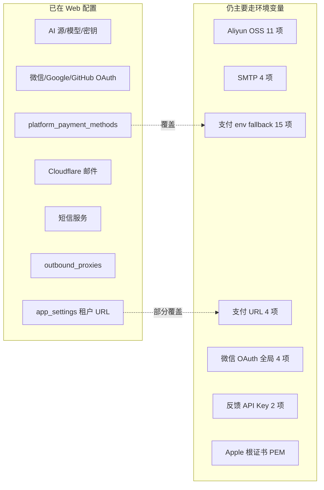

# 环境变量精简与 Web 化方案

最后更新：2026-06-09

目标：把**账号、密钥、业务集成配置**迁入平台 Web 后台；环境变量只保留**进程启动不可替代**的基础设施项。完整现状见 [ENVIRONMENT.md](./ENVIRONMENT.md)。

---

## 1. 设计原则

| 原则 | 说明 |
| --- | --- |
| **Bootstrap vs Runtime** | 连不上 DB 之前必须有的 → 环境变量；连上 DB 后可加载的 → Web / DB |
| **Secret 分层** | JWT、出站代理加密、邮件哈希各自独立密钥；禁止 fallback 到 `JWT_SECRET_KEY` |
| **单一真相源** | 同一配置只保留一条链路：Web 配置 > 环境变量（过渡期）> 代码默认值 |
| **平台级 vs 租户级** | 全局支付/OSS/平台 URL → 平台设置；OAuth/回调 → 租户 `app_settings` |
| **可观测** | 启动日志打印「配置来源摘要」：哪些模块走 DB、哪些仍靠 env fallback |

---

## 2. 目标态：生产最少环境变量

精简后，**标准生产部署**建议只需 **8 个**环境变量：

```bash
# 基础设施（不可 Web 化）
DATABASE_URL=postgresql://...
REDIS_URL=redis://...
JWT_SECRET_KEY=<随机长串>
OUTBOUND_PROXY_ENCRYPTION_KEY=<独立随机长串>
NODE_ENV=production
PORT=3000

# 首次安装 / 冷启动（可在 Web 配好后删除）
CORS_ORIGINS=https://admin.example.com
```

其余 **~100 个**变量全部通过 Web 或代码默认值解决。

### 分类保留说明

| 保留在 env | 原因 |
| --- | --- |
| `DATABASE_URL` | 进程启动、Prisma migrate 前置条件 |
| `REDIS_URL` | 基础设施连接串 |
| `JWT_SECRET_KEY` | 认证主密钥，不宜存 DB 明文 |
| `OUTBOUND_PROXY_ENCRYPTION_KEY` | 主加密密钥，用于解密 DB 中的代理凭据 |
| `NODE_ENV` / `PORT` | 容器/PaaS 标准注入 |
| `CORS_ORIGINS`（可选） | 冷启动时管理后台域名；也可写入 `platform_runtime_settings` 后去掉 |

| 保留在 env（运维，非密钥） | 原因 |
| --- | --- |
| `HTTP_*_LIMIT`、`GATEWAY_*_LOG`、`AI_GATEWAY_*` 调优 | 性能/日志开关，变更频率低，适合 GitOps / Helm values |
| `API_NODE_AI_DEBUG_AUTH_*` | 仅非生产，不应出现在生产 env |
| `PRISMA_SCHEMA_PATH`、`DB_AUTO_MIGRATE` | 容器镜像启动行为 |

---

## 3. 现状：已 Web 化 vs 仍靠 env



**关键发现**：支付、OAuth、邮件（CF）的后台能力已经存在，但代码仍保留 env **双轨**，导致部署文档冗长、新人不知该配哪边。

---

## 4. 迁移计划（分阶段）

### Phase 0 — 文档与约定（当前，低成本）

- [x] 统一清单：[ENVIRONMENT.md](./ENVIRONMENT.md)
- [ ] 新部署文档明确：**业务密钥只配 Web，不配 .env**
- [ ] `.env.example` 只保留「目标态 8 项 + 开发可选项」

### Phase 1 — 去掉重复 fallback（1–2 周，改代码）

**原则**：DB/Web 有配置时，**不再读取**对应 env；env 仅用于本地开发快速起步。

| 模块 | 改动 | 可删除的 env |
| --- | --- | --- |
| 支付 | `payments.service.ts`：`platform_payment_methods` 有活跃记录时忽略 `ALIPAY_*` / `WECHAT_PAY_*`；启动时若无 DB 配置且无 env 则打 warn | 15 项 |
| 支付 URL | `resolveApiBaseUrl` 优先 `platform` 租户 `app_settings.extra_json`；删除 `API_BASE_URL` 等全局 env fallback | 4 项 |
| 微信 OAuth 全局 | `allowedRedirectHosts` 迁入 `platform_runtime_settings` 或 `platform` app `extra_json` | 4 项 |
| SMTP | `email-verification.service` 先查 `email_senders`/SMTP provider，无记录再 fallback env；标记 env 为 deprecated | 4 项 |
| Apple IAP | 根证书存入 `platform_payment_methods`（APPLE_IAP）或 `apple_login_credentials` | 1 项 |
| 反馈 API | 新增 `platform_api_keys` 表 + Web「集成密钥」页；替代 `FEEDBACK_ADMIN_API_KEY` | 2 项 |

**Web 改动（小）**：

- 租户工作区 / 平台设置：增加「API 根 URL」「用户 Web URL」「CORS 允许来源」字段（写入 `app_settings.extra_json` 或新表）
- 支付方式页：已有，补充「未配置时」引导文案
- 支付调度：`PAYMENTS_AUTO_DEDUCTION_*` → 平台设置开关（写入 `platform_runtime_settings`）

### Phase 2 — 新建平台存储设置（2–3 周）

OSS 目前**只走 env**（`upload.service.ts` → `configuration.ts`），需补齐 Web 能力。

**数据模型**（建议）：

```sql
-- platform_storage_providers
id, provider_type ('ALIYUN_OSS' | 'S3' | ...),
name, is_active, is_default,
config_json_encrypted,  -- access_key, secret, bucket, endpoint, cdn_*
created_at, updated_at
```

**Web**：`平台设置 → 对象存储` 页面（与邮件服务页同级）

**代码**：`upload.service.ts` 从 DB 加载默认 provider，env `ALIYUN_*` 仅 dev fallback

可删除 env：**11 项**

### Phase 3 — 平台运行时设置表（1–2 周）

统一存放「原 env 中的全局业务开关」，避免散落在 `extra_json`。

```sql
-- platform_runtime_settings (单行或 key-value)
api_base_url,
admin_frontend_url,
cors_origins,           -- json array
payments_auto_deduction_enabled,
payments_auto_deduction_interval_ms,
payments_auto_deduction_batch_size,
payments_admin_test_disabled,
jwt_expires_in,         -- 可选，非密钥
email_secret_key_encrypted, -- 用主密钥加密存储
updated_at
```

**Web**：`平台设置 → 运行时` 单页表单

可 Web 化 env：**~15 项**（含 CORS、JWT 时效、支付调度）

### Phase 4 — 收口与 CI（持续）

1. 所有 `process.env` 迁入 `configuration.ts`，模块只读 `ConfigService`
2. 启动校验（Zod）：bootstrap 项必填；deprecated env 出现则打 warning
3. CI 脚本：`rg process.env` 结果与 `ENVIRONMENT.md` 附录自动 diff
4. 删除别名：`APPADMIN_URL`、`WECHAT_REDIRECT_URI`、`ALIYUN_OSS_ACCESS_KEY_*` 等

---

## 5. 精简前后对比

| 场景 | 现在 | 目标 |
| --- | --- | --- |
| 最小本地开发 | 2 必填 + 可选几十项 | 2 必填（`DATABASE_URL`、`JWT_SECRET_KEY`） |
| 生产 + 支付 + OSS + 邮件 | ~40–50 env | **8** bootstrap + Web 配置 |
| 支付密钥 | env **或** Web（双轨） | **仅** Web |
| OSS | 仅 env | **仅** Web |
| SMTP | env fallback + CF Web | **仅** Web（CF + SMTP provider） |

---

## 6. 密钥与安全建议

| 密钥 | 存储位置 | 说明 |
| --- | --- | --- |
| `JWT_SECRET_KEY` | 环境变量 / Secret Manager | 永不入 DB 明文 |
| `OUTBOUND_PROXY_ENCRYPTION_KEY` | 环境变量 / Secret Manager | 与 JWT 分离；轮换需重加密 `outbound_proxies` |
| 支付私钥、OSS AK/SK、OAuth secret | DB 加密字段 | 应用层用 `OUTBOUND_PROXY_ENCRYPTION_KEY` 或独立 `PLATFORM_SECRETS_KEY` 加密 |
| `EMAIL_SECRET_KEY` | Phase 3 起存 `platform_runtime_settings`（加密） | 启动时解密加载，不再 env |
| 反馈 / 集成 API Key | `platform_api_keys` | Web 生成、轮换、审计 |

---

## 7. 推荐落地顺序（讨论用）

若资源有限，建议优先级：

1. **Phase 1 支付** — 后台已有，删 env 双轨收益最大、风险最低  
2. **Phase 1 支付 URL + CORS** — 减少部署时「域名配错」类问题  
3. **Phase 2 OSS** — 上传是通用能力，目前唯一纯 env 大块  
4. **Phase 1 SMTP** — 与 CF 邮件页合并体验  
5. **Phase 3 平台运行时表** — 统一收口后再做命名清理  

---

## 8. 待你确认的产品决策

1. **CORS**：是否接受「首次部署写死一个 admin 域名到 env」，其余租户域名全走 DB？  
2. **OSS**：是否只做阿里云，还是抽象成多 provider（S3/R2）？  
3. **SMTP**：是否废弃全局 SMTP env，强制 Cloudflare + 租户发件人？  
4. **支付 env**：是否同意 **Breaking**：下个大版本完全删除 `ALIPAY_*` / `WECHAT_PAY_*` env？  
5. **运维调优**（`AI_GATEWAY_*` 等）：继续 env/GitOps，还是也放进「平台高级设置」？

确认后可按 Phase 拆 issue 实施。
